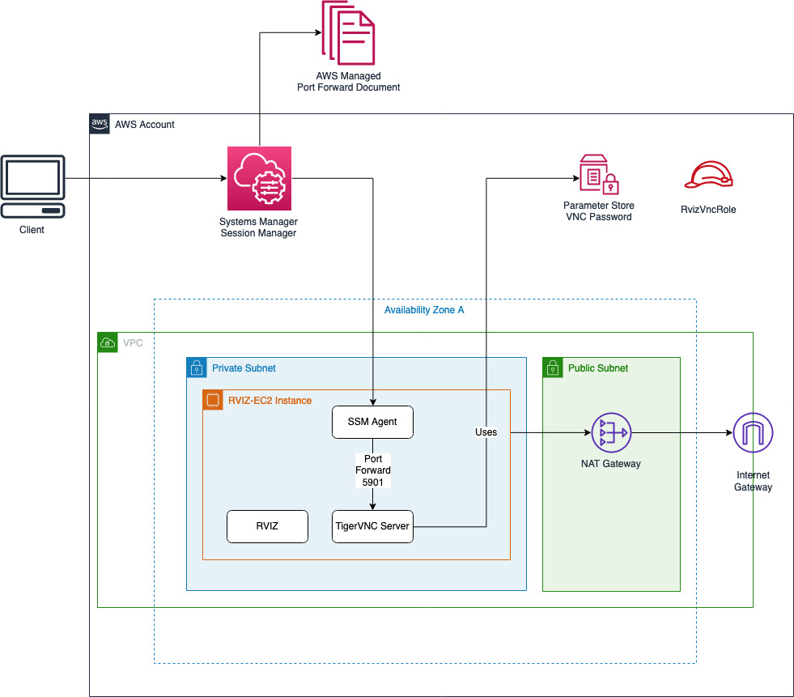

## AWS Autonomous Driving Datalake: Rosbag visualization using RVIZ on EC2

Simple bootstrapper project to
1. Deploy EC2 Instance
2. Install Ubuntu Desktop + TigerVNC
3. Install RViz + Ros tooling
4. Download and setup [Ford AV Data](https://github.com/Ford/AVData)

### Architecture

### Prerequisites
- Nodejs

### Bootstrap (run first time)
1. `npm install`
2. `npm run project-bootstrap` // Configures cdk.json context and creates SSM Parameters

### Deploying and Running
1. Ensure you've run the bootstrapping scripts above and check your values in `cdk.json`
2. `$ npm run cdk deploy" `
3. Wait for the bootstrapping to finish. This can take up to 15 minutes.
To see the progress:
    - SSH into the machine: `$ ./ssm.sh ssh` (If you encounter "is not connected error see below")
    - Switch to ubuntu user: `$ sudo su ubuntu`
    - Tail the log and wait for user-data script to finish: `$ tail -f /var/log/cloud-init-output.log`
4. Run port forwarding to connect via VNC
    - `$ ./ssm.sh vnc`
5. Use your VNC client to connect to `vnc://localhost:5901` using the password set during bootstrpping.

#### SSM TargetNotConnected Error

Follow the troubleshooting guide [here](https://docs.aws.amazon.com/systems-manager/latest/userguide/session-manager-troubleshooting.html#ssh-target-not-connected) for this specific error

In some cases, an outdated version of SSM could be the cause. To update SSM on the instance you can use the following guide [SSM Run Command Guide](https://docs.aws.amazon.com/systems-manager/latest/userguide/mw-walkthrough-console.html#mw-walkthrough-console-register-task)

### Run RVIZ with Ford Demo Data
1. On the VNC session GUI open a new terminal
2. `cd ~/catkin_ws`
3. Run `./0-run-all.sh` to launch the demo

### Resources
- [Setup GUI on EC2](https://aws.amazon.com/premiumsupport/knowledge-center/ec2-linux-2-install-gui/)
- [Add ROS package registry](http://wiki.ros.org/melodic/Installation/Ubuntu#Installation.2BAC8-Ubuntu.2BAC8-Sources.Setup_your_sources.list)
- [Setup VNC](https://www.teknotut.com/en/install-vnc-server-with-gnome-display-on-ubuntu-18-04/)
- [ROS Tooling](http://wiki.ros.org/catkin/Tutorials/create_a_workspace)
- [Ford AV Sample Data](https://github.com/Ford/AVData)
- VNC Config
    - [Ubuntu Desktop + VNC Config](https://www.teknotut.com/en/install-vnc-server-with-gnome-display-on-ubuntu-18-04/)
    - [Ubuntu Desktop + TightVNC](https://www.digitalocean.com/community/tutorials/how-to-install-and-configure-vnc-on-ubuntu-18-04)
    - [Issues with Gnome Shell using TigerVNC](https://gitlab.gnome.org/GNOME/gnome-shell/-/issues/3038)

## CDK Useful commands

 * `npm run build`   compile typescript to js
 * `npm run watch`   watch for changes and compile
 * `npm run test`    perform the jest unit tests
 * `cdk deploy`      deploy this stack to your default AWS account/region
 * `cdk diff`        compare deployed stack with current state
 * `cdk synth`       emits the synthesized CloudFormation template

## Security

See [CONTRIBUTING](CONTRIBUTING.md#security-issue-notifications) for more information.

## License

This library is licensed under the MIT-0 License. See the LICENSE file.
